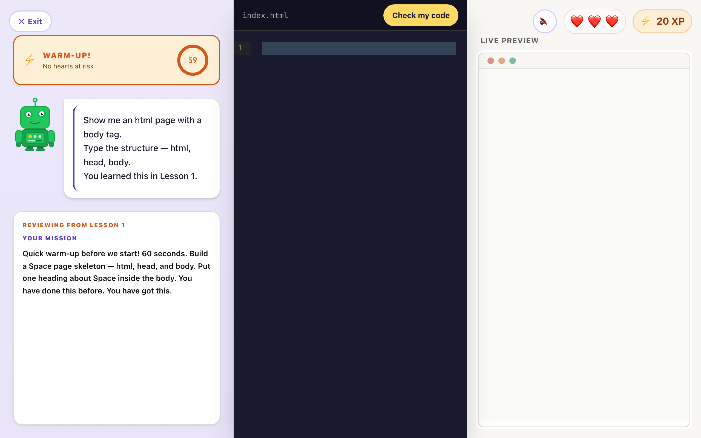

# Code4Kidz

A browser-based HTML and CSS course for kids aged 7–10. The learner picks something they love (dinosaurs, space, their
dog), and every lesson builds a real webpage about it in a live code editor, guided by a robot called Byte.



## How this was built

I designed the product and wrote the curriculum: six lessons, the step types (write, fix a bug, find a bug, make it
yours), the topic personalisation and all of Byte's copy. The first version was prototyped with Replit Agent from those
specs. I then audited that prototype and re-engineered it by hand. The commit history from `chore/strip-scaffold`
onward is that work, one concern per commit, each with the evidence it was tested on.

What the audit found and what changed (with before/after numbers) is in
**[docs/case-study/RESULTS.md](docs/case-study/RESULTS.md)**. The short version:

- **Accessibility:** 0 axe violations on every screen (was 3–6 each). Feedback is announced to screen readers, the hint
  is readable, every control is reachable and visibly focused by keyboard. CI enforces it.
- **Correctness:** the answer checks now verify the task (29 of 123 cases used to fail), plus fixes for a white-screen
  crash, XP that was never awarded, and onboarding screens that were always skipped.
- **Learning design:** pausing to think is never counted as a mistake; hints are always available.
- **Phones:** the lesson screen works at 375px.

## How it works

```
src/
  data/lessons/      Six lessons as typed data: copy (with {topic}), starter code and a validator per step.
                     index.ts is the single registry (lookup, unlock order, copy resolution).
  utils/validator.ts  validate(step, code, topic): a pure function of the learner's code. CSS checks read the
  utils/htmlChecks.ts learner's own <style> rules (via the browser's CSS parser), not the rendered preview.
  lesson/attempt.ts   Pure reducer for one attempt at a step (editing / passed / failed) and the XP and heart rules.
  lesson/streak.ts    Pure daily-streak rules on local calendar days.
  hooks/useLessonMachine.ts  Drives a step: loads it, checks code after a pause (can only pass), "Check my code"
                     (can count a mistake), plays the pass/fail sequence. All timing goes through useTimers,
                     which cancels everything on unmount.
  store/gameStore.ts  Zustand, persisted to localStorage with a versioned migration. Progress only; per-step state
                     lives in the lesson machine.
  pages/, components/ React screens. The preview runs the learner's code in a fully sandboxed iframe (sandbox="").
```

There is no backend: progress lives in the browser.

**Stack:** React 19, TypeScript, Vite, Tailwind CSS v4, Zustand, CodeMirror 6, Framer Motion, React Router.
**Tests:** Vitest + Testing Library (unit and component), Playwright + axe-core (end-to-end and accessibility).

## Run it

Requires Node 20+ and pnpm 9+.

```bash
pnpm install
pnpm dev            # http://localhost:5173
```

| Command | What it does |
|---|---|
| `pnpm check` | Typecheck, lint, unit tests, build (what CI's first job runs) |
| `pnpm test` | Unit and component tests |
| `pnpm e2e` | Playwright end-to-end and axe tests on desktop and phone (builds and serves the app) |
| `pnpm build` / `pnpm preview` | Production build to `dist/`, and serve it |
| `node scripts/a11y-report.mjs <dir>` | axe violations, accessibility tree and screenshot per screen (needs `pnpm preview` running) |

## Deploy

Any static host. `vercel.json` rewrites every path to `index.html` so client-side routes survive a refresh.
Build command `pnpm build`, output directory `dist`.

## Known gaps

- The accessibility work has been verified with axe and accessibility-tree snapshots, not yet with a recording from a
  real screen reader.
- Lessons 7–10 and "Level 2: JavaScript" on the map are placeholders.
- "Share achievement" on the completion screen shares a link that only works on the learner's own device.
